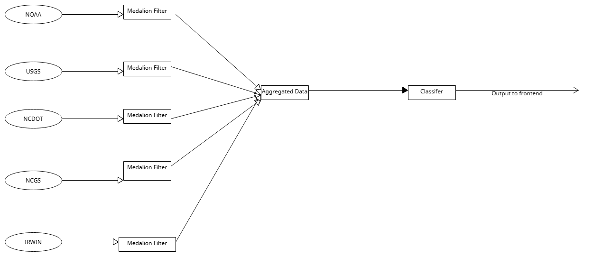

Team: Code Crafters
Team Members: Kadin Ogueboule and Pujit Varma Muppala
# NearMe

**NearMe** is a hazard-aware routing platform built for **WolfHacks 2026** that helps users find routes across North Carolina while considering environmental and safety conditions.

Instead of only asking:

> What is the shortest route?

NearMe asks:

> What is the safest route based on current environmental risk?

---

## What It Does

NearMe combines multiple environmental and hazard datasets into a single geospatial system and uses them to influence route selection.

The platform considers:

- Air quality
- Weather
- Water conditions
- Traffic crashes
- Landslides
- Flood zones
- Wildfires

Each location receives a normalized **severity score** and **clemency score**, allowing the system to compare very different hazards on one common scale.

The frontend uses this processed data to visualize environmental conditions and calculate a lower-risk route between two locations.

---

## Key Features

- Hazard-aware **A\*** route finding
- Interactive **Leaflet** map
- Environmental severity and clemency scoring
- **K-Means** and **DBSCAN** clustering
- Databricks **Bronze / Silver / Gold** Medallion Architecture
- Unified GIS layer combining multiple hazard sources
- Flask backend with Databricks integration
- GitHub Pages compatible deployment
- Live and exported Databricks data support

---

## Data Sources

| Source | Data |
|---|---|
| EPA | Air quality |
| NOAA / NWS | Weather observations and alerts |
| USGS | Water monitoring |
| NCDOT | Traffic crashes |
| NCGS | Landslide inventory |
| NC Emergency Management | Flood zones |
| IRWIN | Wildfire incidents |

---

## How It Works

```text
Public Data Sources
        ↓
Datastream Ingestion
        ↓
Bronze Delta Tables
        ↓
Cleaning + Standardization
        ↓
Silver Tables
        ↓
Aggregation + Feature Engineering
        ↓
Gold Tables
        ↓
K-Means / DBSCAN Classification
        ↓
Severity + Clemency Scores
        ↓
GIS Layer + A* Routing
        ↓
Interactive Frontend
```

---

## Clemency Scoring

NearMe converts different environmental measurements into a normalized severity scale.

```text
Severity: 0.0 → 1.0
          Mild    Extreme
```

Clemency is calculated as:

```text
clemency_score = 1 - severity_score
```

Conditions are categorized as:

- Benign
- Mild
- Moderate
- Severe
- Extreme

---

## Machine Learning

NearMe uses unsupervised learning to group environmental conditions without requiring a manually labeled training dataset.

### K-Means

K-Means groups observations with similar environmental severity patterns.

### DBSCAN

DBSCAN identifies dense environmental clusters and unusual observations.

The final classifier combines environmental sources into one severity-labeled dataset.

---

## Architecture



NearMe uses **Databricks** as the main data-processing platform.

The Medallion pipeline:

- preserves raw data in the **Bronze** layer
- cleans and standardizes data in the **Silver** layer
- creates analytics-ready data in the **Gold** layer

The processed data is then used by the classifier, GIS pipeline, and frontend.

---

## Data Pipeline

The ingestion process collects raw environmental and hazard information from:

```text
EPA
NOAA
USGS
NCDOT
NCGS
NCEM
IRWIN
```

### Bronze Layer

The Bronze layer contains raw or minimally transformed data.

Examples:

```text
bronze_epa_air_quality
bronze_noaa_weather_observations
bronze_noaa_weather_alerts
bronze_usgs_water_data
bronze_ncdot_crash_data
bronze_ncgs_landslide_data
bronze_ncem_flood_zones
bronze_irwin_fire_incidents
```

### Silver Layer

The Silver layer handles:

- Data cleaning
- Schema standardization
- Timestamp normalization
- Coordinate cleanup
- Invalid record removal
- Preparation for cross-source analysis

### Gold Layer

The Gold layer contains analytics-ready datasets used for:

- GIS visualization
- Machine learning
- Severity scoring
- Frontend data access
- Routing

---

## GIS Processing

NearMe creates a unified GIS layer combining all supported environmental and hazard sources.

The GIS layer includes:

- EPA air-quality observations
- NOAA weather observations
- USGS water-monitoring locations
- NCDOT crash locations
- NCGS landslides
- NCEM flood zones
- IRWIN wildfire incidents

All sources are normalized into a common geographic format using latitude and longitude.

The GIS workflow is implemented in:

```text
nearme_gis_mapping.ipynb
```

---

## Routing

NearMe uses a modified **A\*** routing approach.

Traditional A* minimizes:

```text
f(n) = g(n) + h(n)
```

Where:

- `g(n)` is the cost already traveled
- `h(n)` is the estimated remaining distance

NearMe also incorporates environmental severity into the route cost.

```text
Route Cost =
Distance Cost
+
Environmental Severity Penalty
```

This allows NearMe to prefer lower-risk paths when alternative routes are available.

---

## Frontend

The frontend is built using:

- HTML
- CSS
- JavaScript
- Leaflet

The application includes:

- Interactive North Carolina map
- Start-location input
- Destination input
- Route rendering
- Environmental overlays
- Severity visualization
- Hazard markers
- Source-specific map colors
- Clemency legend
- Route status information

The frontend is located in:

```text
docs/
```

---

## Backend

NearMe includes a lightweight Flask backend connecting the frontend to Databricks.

The backend supports:

- Flask application serving
- `/health` endpoint
- `/api/clemency` endpoint
- Databricks SDK integration
- CORS support
- In-memory caching
- Live clemency-data retrieval

A short cache is used to reduce repeated requests to Databricks.

---

## Databricks Integration

Databricks is the central data platform for NearMe.

It handles:

- Data ingestion
- Delta tables
- Bronze / Silver / Gold layers
- PySpark transformations
- Geospatial preparation
- Environmental feature engineering
- Severity scoring
- Clustering
- Frontend data preparation

The application can retrieve processed data using the Databricks SDK.

---

## Static Data Export

For GitHub Pages deployment, processed Databricks data can be exported into:

```text
docs/clemency_data.json
```

The exported dataset contains fields such as:

```text
latitude
longitude
severity_score
clemency_score
source_type
kmeans_clemency
detail
```

This allows the frontend to continue functioning even if a live Databricks backend is unavailable.

---

## Tech Stack

### Data Engineering

- Databricks
- Apache Spark
- PySpark
- Delta Lake
- SQL
- Python

### Machine Learning

- K-Means
- DBSCAN
- Feature engineering
- Unsupervised clustering

### Backend

- Python
- Flask
- Databricks SDK

### Frontend

- HTML
- CSS
- JavaScript
- Leaflet

### Geospatial / Routing

- Latitude / longitude processing
- Environmental GIS layers
- Hazard visualization
- Severity grid
- A* pathfinding

### Deployment

- GitHub Pages
- Databricks Apps

---

## Repository Structure

```text
nearme/
│
├── README.md
├── .gitignore
│
├── datastream_ingestion.ipynb
├── medallion_pipeline.ipynb
├── nearme_gis_mapping.ipynb
│
├── nearme/
│   └── clemency_classifier.ipynb
│
├── documentation/
│   ├── about.md
│   └── data-flow.png
│
└── docs/
    ├── index.html
    ├── style.css
    ├── app.js
    ├── app.py
    ├── app.yaml
    ├── app.yml
    ├── requirements.txt
    ├── export_data.py
    └── clemency_data.json
```

---

## Main Project Files

### `datastream_ingestion.ipynb`

Handles ingestion of environmental and hazard datasets into Databricks.

### `medallion_pipeline.ipynb`

Processes the datasets through Bronze, Silver, and Gold layers.

### `nearme_gis_mapping.ipynb`

Combines all environmental and hazard datasets into a unified GIS representation.

### `nearme/clemency_classifier.ipynb`

Uses feature engineering, K-Means, and DBSCAN to assign severity and clemency labels.

### `docs/app.js`

Handles:

- Leaflet map logic
- Route rendering
- Hazard overlays
- Severity visualization
- A* pathfinding
- Frontend data handling

### `docs/app.py`

Handles:

- Flask backend
- Databricks integration
- `/health`
- `/api/clemency`
- Caching
- CORS configuration

### `docs/export_data.py`

Exports processed Databricks clemency data into JSON for GitHub Pages.

### `docs/clemency_data.json`

Contains exported clemency-labeled environmental data used by the frontend.

---

## Example Workflow

```text
User enters start and destination
        ↓
Frontend loads environmental data
        ↓
Environmental severity grid is generated
        ↓
A* evaluates possible paths
        ↓
High-severity areas receive higher route costs
        ↓
Lower-risk path is selected
        ↓
Route is rendered on the map
```

---

## Why NearMe?

Environmental information is often spread across many different agencies and platforms.

A user may need to separately check:

```text
Weather
+
Flood Maps
+
Wildfire Maps
+
Air Quality
+
Traffic Conditions
+
Landslide Data
```

NearMe combines these datasets into one system and converts them into an actionable routing decision.

Instead of simply showing hazards, NearMe uses them to answer:

> Which route should I take?

---

## Deployment

NearMe supports two deployment approaches.
Databricks Deployed application actively pulls data and the Github deployed application uses static data.

### Live Backend Mode

```text
Databricks
    ↓
Flask API
    ↓
Frontend
```

### Static GitHub Pages Mode

```text
Databricks
    ↓
JSON Export
    ↓
GitHub Pages
```

This dual approach allows the application to remain demonstrable even if the live backend is unavailable.

---

AI Usage

We used Databricks Genie Code and other AI-assisted development tools as part of our engineering workflow.

AI was primarily used to accelerate prototyping, suggest implementation patterns, assist with debugging, and help refine portions of the codebase. The team remained responsible for validating outputs, designing the overall system architecture, integrating the data pipeline, defining the clemency and severity logic, and testing the final application.

Rather than treating AI as a black-box solution, we used it as a collaborative development tool to iterate faster while maintaining human oversight over technical decisions, data processing, model behavior, and final implementation. 

## Challenges

### Combining Different Data Sources

The datasets use different schemas, measurement units, structures, and update formats.

We standardized the data through the Databricks Medallion pipeline.

### Creating One Severity Scale

Air quality, weather, floods, crashes, landslides, and wildfires cannot be directly compared.

We created normalized severity and clemency scores so different hazards could influence the same routing system.

### Geographic Normalization

Some datasets provide geographic coordinates directly while others require additional processing.

Records are standardized around latitude and longitude.

### Connecting Environmental Risk to Routing

Environmental conditions do not naturally map to traditional routing algorithms.

NearMe incorporates environmental severity into the A* route cost.

---

## What We Built

During WolfHacks, NearMe combined:

- 7 environmental and hazard data categories
- Databricks data ingestion
- Bronze / Silver / Gold processing
- PySpark transformations
- GIS aggregation
- K-Means clustering
- DBSCAN clustering
- Severity scoring
- Clemency scoring
- A* pathfinding
- Flask backend
- Databricks SDK integration
- Interactive Leaflet frontend
- GitHub Pages deployment support

---

## Future Improvements

- Real road-network routing
- Live route updates
- Predictive hazard forecasting
- Mobile GPS support
- Expansion beyond North Carolina
- Emergency shelter routing
- Live hazard alerts
- Temporal risk models
- Route comparison by safety, distance, and travel time
- Infrastructure risk analysis

---

## Acknowledgments

NearMe uses publicly available environmental and hazard data from organizations including:

- EPA
- NOAA / National Weather Service
- USGS
- NCDOT
- North Carolina Geological Survey
- North Carolina Emergency Management
- IRWIN

Built with **Databricks, Apache Spark, PySpark, Flask, Leaflet, and JavaScript**.
